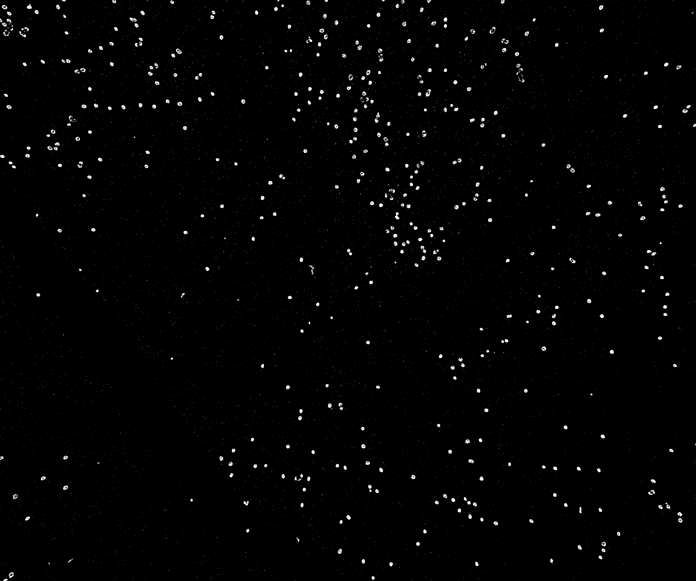
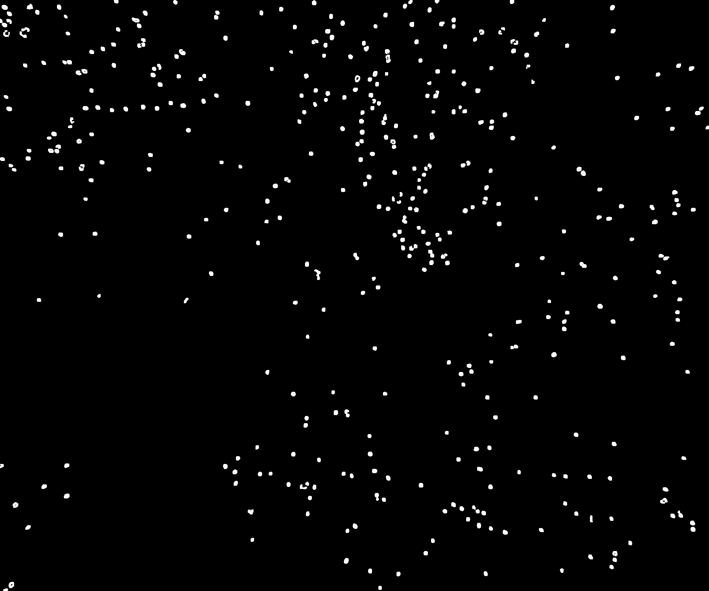
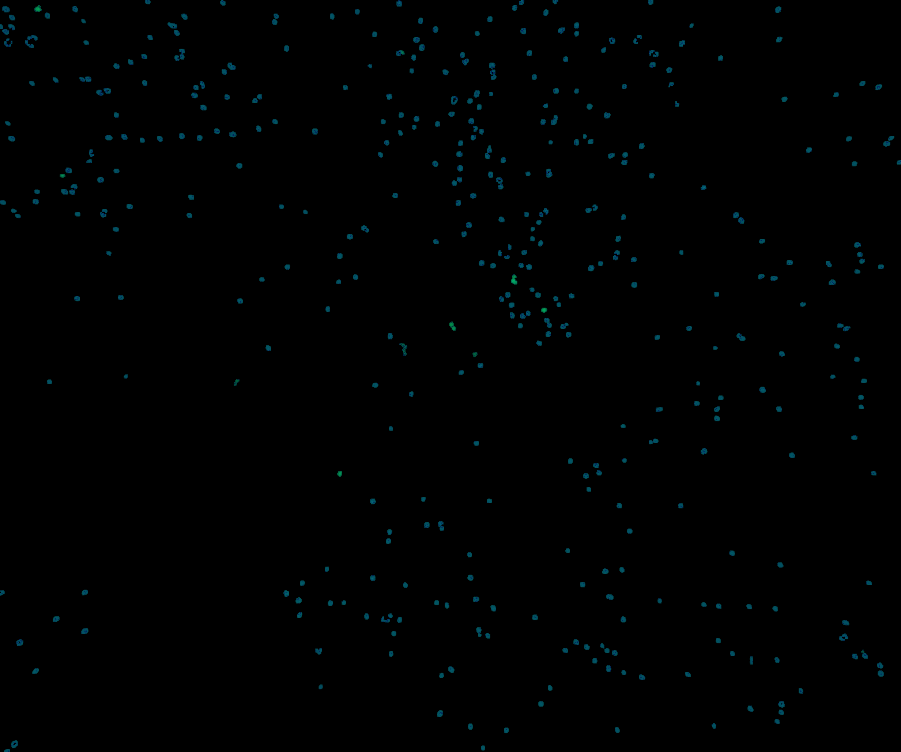

# Microscopy-Cell-Segmentation-and-Quantification
These scripts were used to perform the cell segmentation and counting for statistical analysis associated with the study titled:

**"Protocol for intracardiac delivery and live imaging of NK–tumor interactions in an ex ovo chick embryo model."**

It provides a structured and reproducible workflow for data processing and analysis.

# Introduction:
In the protocol for intracardiac delivery and live imaging of NK–tumor interactions in an ex ovo chick embryo model, segmentation is performed to identify two types of cells: Hoechst-labeled NK cells, which appear as blue fluorescent cells, and GFP-positive neuroblastoma cells, which appear as green fluorescent cells. The segmentation approach vary depending on the signal quality and the imaging time point.

A Python-based analysis scripts are designed for the segmentation and quantification of both cell types. The workflow includes classical image processing techniques as well as deep learning-based methods.

**Note:** The scripts can also be used in the Google Colab environment by uploading the dataset, eliminating the need for local setup. The `notebooks/` folder contains a ready-to-use Google Colab notebook along with detailed instructions and a complete explanation of the workflow.

The provided scripts are ready to use and can be executed by simply specifying the dataset path, which is clearly indicated within scripts. There are certain parameters may need to be adjusted depending on the dataset; these parameters and their effects are explained below in the description of scripts.

## 1. Preprocessing
Before segmentation, background removal is performed, as fluorescence image backgrounds can significantly interfere with accurate cell detection. The dataset used in this study contains two types of images based on their background color:
- `bg_removal_blue_mode.py` – Preprocessing script for images with blue fluorescence background.
- `bg_removal_green_mode.py` – Preprocessing script for images with green fluorescence background.

Because the color distribution and background noise are different in these two datasets, we use two separate preprocessing scripts, each tuned for its respective background color.

#### Description of bg_removal_blue_mode.py:

This script is designed for images where the background contains a blue haze and the blue cells have weak signals with green interference dots.

Processing Steps (also shared with the green background script)

Gaussian background subtraction, LAB-based contrast enhancement, HSV conversion, Binary masking, Morphology cleaning, Connected-component filtering, Replace background with black, and then Save final processed image

#### Key Adjustable Parameters

The blue-background preprocessing script allows several parameters to be tuned depending on the image intensity and noise level. The blue detection is primarily controlled by the hue range (75–160) and the relaxed saturation (≥45) and brightness thresholds (≥80), which help capture weak blue cells.

Additionally, a blue-dominance rule (B > G + 25 and B > R + 25) ensures that even faint blue cells are detected while suppressing non-cell regions.

Two levels of area filtering are applied:

- **Initial minimum area:** 80 px – removes small noise artifacts
- **Final minimum area:** 120 px – retains only valid cell regions

Since blue cells often contain small green interference dots, the script includes color-correction parameters, reducing the green channel to 40% and the red channel to 85% for pixels classified as “only blue.” These parameters can be relaxed or tightened depending on how strong or weak the blue fluorescence appears in the dataset.

Below is the example output produced using the following script.

Original → Background Subtracted → Enhanced

    

HSV → Raw Green Mask → Clean Mask

    

#### Final Output Image

#### Description of bg_removal_green_mode.py:

This script is optimized for images where the background contains green fluorescence artifacts and faint green signals that must be preserved.

#### Key Adjustable Parameters

The green-background preprocessing script uses flexible thresholds to preserve even faint green fluorescence. The primary HSV mask uses a wide hue range (25–105) with relaxed saturation (>5) and value (>15) limits, allowing detection of low-intensity green cells.

The secondary green-intensity mask relies on green dominance (G > R + 5 and G > B + 5) to keep genuine cells while suppressing background noise.

Since some green cells may be extremely small, the minimum connected-component size is set to 3 pixels, making the detection permissive.

The script also uses CLAHE enhancement (clipLimit = 3.0) to amplify visibility of dim and small green cells. These parameters can be adjusted based on the fluorescence strength and noise level across different image batches.

## 2. Cell_Seg_Count:

Once the background has been removed from the images, you can proceed with segmentation and proximity analysis using the Step 04 scripts. You may try both methods and choose the one that provides better results for your data. It is recommended to first try the Otsu-based method, as it does not require GPU support and is faster to execute, whereas the Cellpose-based method requires GPU access and may take longer to run. The following scripts are available in the folder.

- **2a.** `Otsu_based_seg.py`
- **2b.** `Otsu_based_single_cell.py`
- **2c.** `Cellpose_based_seg.py`

#### 2a. Otsu_based_seg.py
To run this script, go to the 0. USER CONFIG section and provide:

the path of the input image with the background already removed, and
 the output directory where the result images will be saved.

The output includes:

the total count of blue cells and green cells, and the proximity analysis based on the selected radius, showing how many blue cells are present around each green cell.

The results are also generated in table format for easier interpretation and handling. In addition, you need to set the radius value according to your requirement in Section 5: px Radius Analysis of the code.

#### Adjustable Parameters in Otsu based script

| Category | Parameter | Current Value | Description | Effect if Adjusted |
|----------|-----------|--------------|-------------|--------------------|
| Thresholding | `Otsu Threshold` | Automatic | Separates cells from background | Changing thresholding strategy can alter detected cell regions |
| Watershed Seed Detection | `min_distance` | `4` | Minimum distance between detected cell centers | Larger value reduces over-segmentation of nearby cells |
| Noise Removal | `len(xs) < 5` | `5` pixels | Minimum pixel count required for a detected cell region | Increasing removes very small detected objects |
| Green Cell Filter | `area < 20`, `w < 6`, `h < 6` | `20, 6, 6` | Removes small green cell fragments | Increasing thresholds removes small green blobs |
| Blue Cell Filter | `area < 40`, `w < 20`, `h < 20` | `40, 20, 20` | Removes small blue fragments | Larger values keep only larger blue cells |
#### 2b. Otsu_based_single_cell.py
**This script is identical to the above but is specifically designed for images containing only green cells (CONTROL GROUP), focusing on single-cell segmentation and counting without proximity analysis.**

#### 2c. Cellpose_based_seg.py

To run this script, go to the 0. USER CONFIG section and provide:

the path of the input image with the background already removed, and the output directory where the result images will be saved.

The output includes:

the total count of blue cells and green cells, and the proximity analysis based on the selected radius, showing how many blue cells are present around each green cell.

The results are also generated in table format for easier interpretation and handling. In addition, you need to set the radius value according to your requirement in Section 6: px Radius Analysis of the code.

#### Adjustable Parameters in Cellpose script

| Category | Parameter | Current Value | Description | Effect if Adjusted |
|----------|-----------|--------------|-------------|--------------------|
| Cellpose | `model_type` | `cyto2` | Pretrained Cellpose model used for segmentation | Changing to `cyto` or `nuclei` alters the type of cellular structures detected |
| Cellpose | `diameter` | `None` | Expected cell diameter in pixels | Setting a value (e.g., `30–50`) helps Cellpose detect correct cell size |
| Cellpose | `min_size` | `5` | Minimum size of detected objects kept as cells | Increasing removes small noise but may miss very small cells |
| Cellpose | `rescale` | `0.75` | Image scaling factor before segmentation | Lower values speed up processing but may reduce segmentation accuracy |
| Color Classification (Green) | `G_cell > B_cell * 1.15` | `1.15` | Threshold for classifying pixels as green-dominant cells | Higher value makes green detection stricter |
| Color Classification (Blue) | `B_cell > G_cell * 1.05` | `1.05` | Threshold for classifying pixels as blue-dominant cells | Higher value makes blue detection stricter |

Example Output Produced by the Segmentation Script

Input → Preprocess → Cellpose Mask → Watershed

     

Final Output

  

